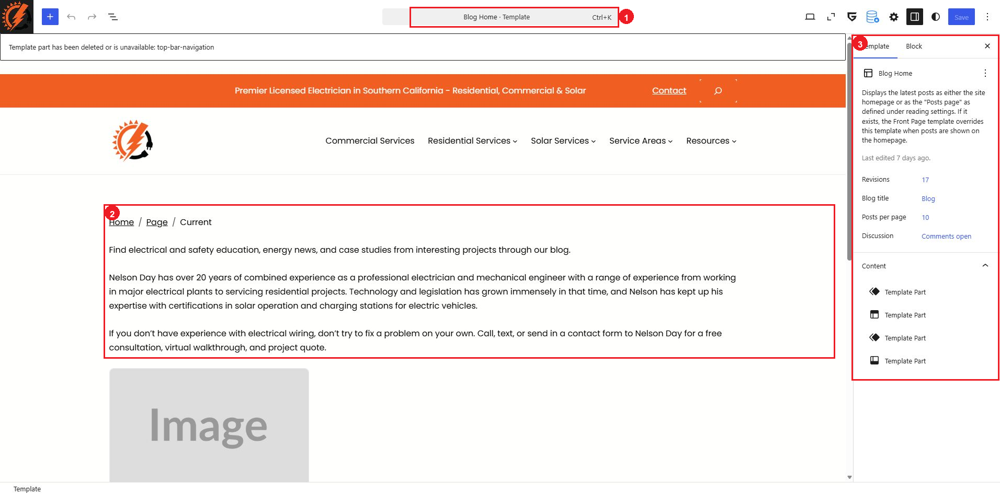

# Blog List

The blog list at `/blog/` displays published posts automatically. Its post cards come from `Posts`, while the introductory text and the arrangement of the list come from the `Blog Home` template.

## The Blog Page and the Blog Home Template Are Different

In `Pages > All Pages`, the page named `Blog` is marked `Posts Page`. When it is opened, WordPress displays this notice:

> You are currently editing the page that shows your latest posts.

That page establishes the blog address, but it does not contain the visible blog-list layout. Do not add blocks to the `Blog` page to change the introduction or post cards.

Use the appropriate location for the type of change:

| Change needed | Where to make it |
|---|---|
| Add, edit, or remove an article | `Posts > All Posts` |
| Change a post's title, featured image, excerpt, or category | Open that post in `Posts > All Posts` |
| Change the blog introduction or list layout | `Appearance > Editor > Templates > All templates > Blog Home` |

## How Posts Appear on the Blog List

The `Blog Home` template currently uses a `Query Loop`. Inside it, the `Post Template` controls the repeated information shown for each article, including `Featured Image`, `Categories`, `Title`, `Excerpt`, and the `Read More` link.

Publishing or updating a post updates the blog list automatically. You do not need to add the post manually to the `Blog` page.

For a consistent list, each post should have:

* A clear title.
* A featured image with a similar shape and size to the other post images.
* A short excerpt.
* The correct category.

## Open the Blog Home Template

Only open the template when the shared blog introduction or list structure needs to change.

1. Go to `Appearance > Editor`.
2. Under `Design`, select `Templates`.
3. Select `All templates`.
4. Select `Blog Home`.

The numbered callouts identify:

1. `Blog Home · Template`, confirming that the template—not the `Blog` page—is open.
2. The introductory content displayed above the post list.
3. The `Template` settings and `Content` list.

The template's right sidebar currently includes `Revisions`, `Blog title`, `Posts per page`, `Discussion`, and `Content`.

Changing `Posts per page` changes how many articles can appear before visitors move to another results page. Changing blocks inside `Query Loop > Post Template` changes every repeated post card, not just one article.

If the editor reports that a template part has been deleted or is unavailable, do not save the template. Take a screenshot of the message and contact the website administrator.

## Safely Update the Blog Introduction

1. In `Blog Home`, select the existing introductory paragraph you need to change.
2. Edit only the wording inside that paragraph block.
3. Leave the surrounding `Columns`, `Group`, and `Query Loop` structure in place.
4. Use `View` to preview the result.
5. Select `Save` only after confirming that the introduction and post list still display correctly.

## Changes That Need Extra Care

Ask the website administrator or an experienced editor before:

* Moving, deleting, or replacing the `Query Loop`.
* Changing blocks inside `Post Template`.
* Changing the number of columns or the pagination design.
* Editing the Header, Footer, or another `Template Part` from this screen.
* Changing responsive, spacing, or advanced GreenShift settings.

These are shared template changes and can affect the complete blog list.

## Check the Blog List

After publishing a post or saving an approved template change:

1. Open the public `/blog/` page and refresh it.
2. Confirm that the newest published post appears in the expected order.
3. Check its featured image, title, category, excerpt, and `Read More` link.
4. Open the post from the card and confirm that the destination is correct.
5. Check the blog list on desktop and in a narrow mobile-sized window.

## Block Editor Tutorials

* [Using the Block Editor — Learn WordPress](https://learn.wordpress.org/tutorials/using-the-block-editor/)
* [WordPress Query Loop block documentation](https://wordpress.org/documentation/article/query-loop-block/)
* [GreenShift video tutorial playlist on YouTube](https://www.youtube.com/playlist?list=PLIEKo1RENmYxv7s01erTf4Y6JbClr5AEk)
