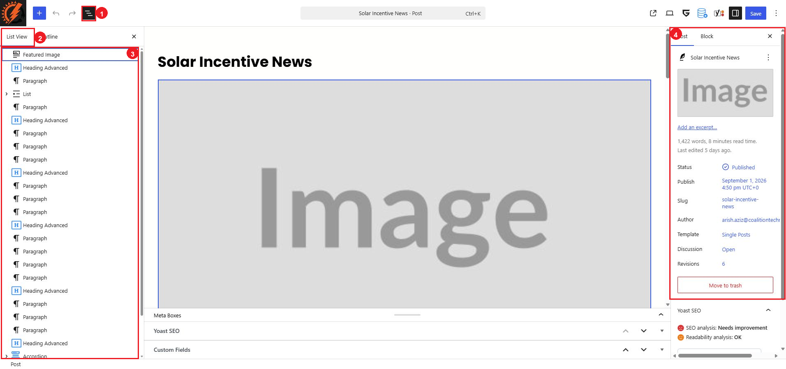

# Blog Posts

A blog post is an individual article. Posts are managed under `Posts`, not `Pages`. Published posts are added automatically to the blog list.

## Open or Add a Post

To edit an existing article:

1. Go to `Posts > All Posts`.
2. Find the article. Use `Search Posts` if needed.
3. Select the post title, or hover over the row and select `Edit`.

To start a new article, go to `Posts > Add Post`. Do not publish a new article until its text, links, featured image, excerpt, and category have been reviewed.

## Understand the Post Editor

The numbered callouts identify:

1. The `Document Overview` button.
2. The `List View` tab.
3. The article's content blocks.
4. The `Post` settings panel.

The current post content includes blocks such as `Featured Image`, `Heading Advanced`, `Paragraph`, `List`, and `Accordion`. Select an existing block in List View to find the same item in the article. When a block is selected, its editing options appear in the `Block` tab on the right.

## Edit the Article Content

### Title and Body

1. Select the title or an existing content block.
2. Edit the wording directly in the editor.
3. Keep the existing heading levels and surrounding blocks in place.
4. Use short paragraphs and descriptive link text so the article is easy to scan.

For factual, legal, financial, safety, or time-sensitive claims, confirm the source and review date before publishing. Do not treat an old article as evidence that a current claim is still accurate.

### Featured Image

The featured image is displayed in the `Post` tab. Use `Edit or replace the featured image`, then `Replace`, to choose the approved image. Confirm the image is optimized and has suitable alternative text.

### Excerpt

Select `Add an excerpt…` in the `Post` tab and enter a short summary. The `Blog Home` template uses the `Excerpt` block in each repeated post card, so a concise excerpt helps keep the blog list consistent.

### Categories and Tags

Open `Categories` or `Tags` in the `Post` tab. Select the existing category that best describes the article. Create a new category or tag only when the website administrator has approved it.

## Use the Post Settings Carefully

The `Post` tab currently includes `Status`, `Publish`, `Slug`, `Author`, `Template`, `Discussion`, `Revisions`, `Categories`, and `Tags`.

For a routine article update:

* Leave `Template` set to `Single Posts`.
* Do not change `Slug` for an existing post unless a URL change and redirect have been approved.
* Review the `Publish` date before publishing or scheduling a new article.
* Use `Revisions` to review a previously saved version when necessary.

The shared layout for all articles is under `Appearance > Editor > Templates > All templates > Single Posts`. Do not edit that template when you only need to change one article.

## Preview, Save, and Check the Post

1. Open `View` in the upper-right toolbar and preview the post.
2. Check the title, featured image, headings, lists, links, and any accordion items.
3. Check the article at desktop width and in a narrow mobile-sized window.
4. Select `Save` only after the preview is correct.
5. Open `View Post`, refresh it, and confirm the saved result.
6. Open `/blog/` and confirm the post card has the correct image, title, category, excerpt, and link.

Before saving, use `Undo` in the upper-left toolbar to reverse an accidental change. If the change was already saved, open `Revisions` in the `Post` tab and review the revision carefully before restoring it.

## Changes That Need Extra Care

Ask the website administrator or an experienced editor before:

* Changing the `Single Posts` template.
* Adding a new block type or complex layout to an article.
* Changing responsive, spacing, animation, or advanced GreenShift settings.
* Adding custom code, embedded scripts, or unfamiliar third-party content.
* Changing an existing post URL.

## Block Editor Tutorials

* [Using the Block Editor — Learn WordPress](https://learn.wordpress.org/tutorials/using-the-block-editor/)
* [WordPress Block Editor documentation](https://wordpress.org/documentation/article/wordpress-block-editor/)
* [GreenShift video tutorial playlist on YouTube](https://www.youtube.com/playlist?list=PLIEKo1RENmYxv7s01erTf4Y6JbClr5AEk)
