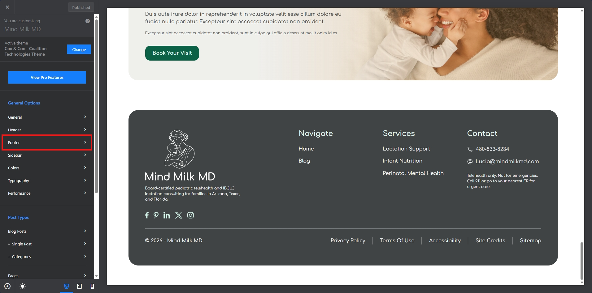
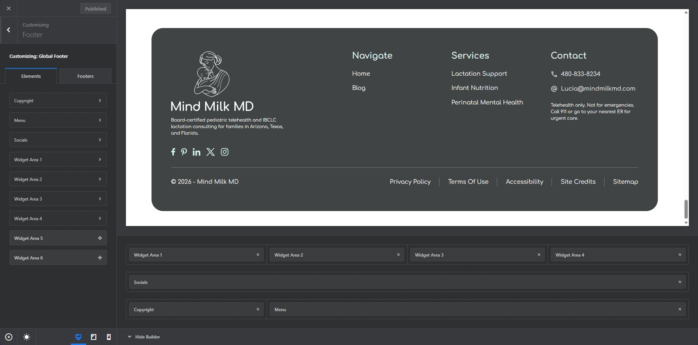
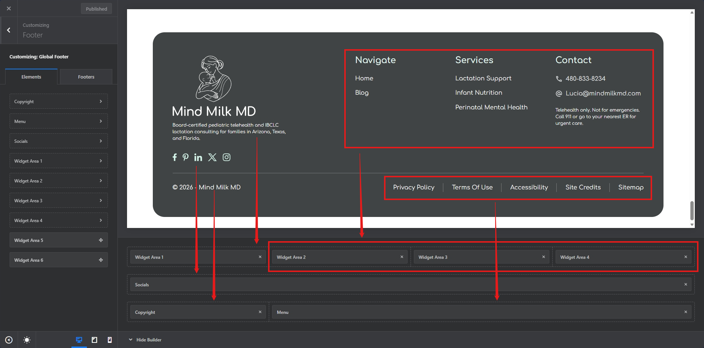

# Footer

1 - Navigation to Customizer and click Footer:

2 - That should display all the elements used in the footer:

3 - Following is how the elements are placed in the footer, click on the one needs to be edited:

4 - Clicking should open a panel in sidebar, edit the content as you need.

5 - Once Changed, then publish the changes.