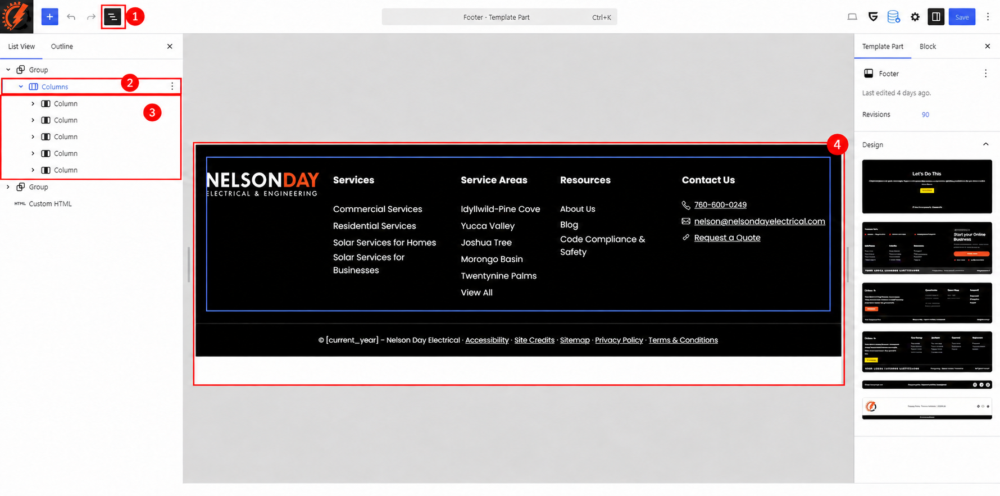
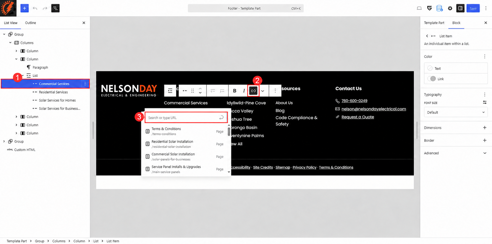

# Footer

The Nelson Day Electrical footer appears at the bottom of every page. It contains the company logo, service and service-area links, resource links, contact details, and the copyright and policy links.

The footer is a shared template part. Saving a change updates every page that uses it, so check the homepage and at least one inner page afterward.

Click any screenshot to enlarge it and read the editor controls. Screenshots show the staging website as it appeared when this guide was prepared. Always use the approved wording and destination for the website you are editing.

## Open the Footer Editor

1. Log in to the WordPress dashboard.
2. Go to `Appearance > Editor` to open the Site Editor.
3. Select `Patterns` from the Design menu.
4. Select `Footer` under the template part categories in the left sidebar.
5. Hover over the Footer preview, open its three-dot menu, and select `Edit`.

Use the existing Footer template part. The alternative footer designs shown under `Template Part > Design` are separate designs and should not be selected during a routine content update.

## Find the Element to Edit

Click `Document Overview` (the three-horizontal-lines button) near the upper-left corner, then stay on the `List View` tab. Expand the arrows beside the blocks to see the footer structure.

The numbered callouts identify:

1. The black `Document Overview` button that opens List View.
2. The main `Columns` block.
3. The five individual `Column` blocks.
4. The footer preview.

The saved footer contains these main blocks:

| Block in List View | Contents or purpose |
|---|---|
| First `Group` > `Columns` | The main five-column footer area |
| Column 1 | Company logo linked to the homepage |
| Column 2 | `Services` heading and service links |
| Column 3 | `Service Areas` heading and location links |
| Column 4 | `Resources` heading and resource links |
| Column 5 | `Contact Us`, phone, email, and `Request a Quote` |
| Second `Group` > `Row` > `Paragraph` | Copyright text and the policy links |
| `Custom HTML` | Existing footer code; leave this block intact during routine content edits |

Select a block in List View to highlight it in the preview. If the right settings sidebar is closed, click the `Settings` button near the upper-right corner and choose the `Block` tab.

## Change a Heading or Link Label

The `Services`, `Service Areas`, and `Resources` headings are Paragraph blocks. The links beneath them are List Item blocks.

1. In List View, expand the first `Group`, then `Columns`.
2. Expand the Column containing the item you want to change.
3. Select the Paragraph for a heading or select the named List Item for a link.
4. Click the visible words in the preview and replace only the approved text.
5. Keep headings short and use clear, descriptive wording for links.

Changing a link's visible words does not automatically change its destination. Follow the next section when the destination must also change.

## Change a Link Destination

1. Select the named List Item in List View. In this example, `Commercial Services` is selected.
2. Click the chain-shaped `Link` button in the floating block toolbar.
3. Use the `Search or type URL` field to find an existing page or enter the approved destination.
4. Choose the correct page from the suggestions. If you enter a URL manually, apply it with the submit arrow or the Enter key.
5. Test the link on the public website after saving.

The numbered callouts identify the selected List Item (1), the `Link` button (2), and the `Search or type URL` control (3).

For an internal link, choose the page returned by WordPress when possible. If a full URL is required, use the address for the website being edited; do not copy the staging hostname into the live website.

## Change the Company Logo

1. Expand the first Column and select its `Image` block.
2. Click `Replace` in the block toolbar.
3. Select `Open Media Library` to choose an approved existing image, or select `Upload` for an approved replacement file.
4. Preserve the existing proportions and display size.
5. Confirm that clicking the logo opens the homepage after saving.

## Change Contact Details

Expand the fifth Column under `Contact Us`. Each contact line is a Row containing an icon and a Paragraph.

### Phone Number

1. Select the Paragraph containing `760-600-0249`.
2. Replace the visible number with the approved number.
3. Open the `Link` control and update the telephone destination as well. A telephone link begins with `tel:` and contains only the dialable number, such as `tel:7606000249`.

### Email Address

1. Select the Paragraph containing `nelson@nelsondayelectrical.com`.
2. Replace the visible address with the approved address.
3. Open the `Link` control and update the email destination. An email link begins with `mailto:`, such as `mailto:nelson@nelsondayelectrical.com`.

### Request a Quote

1. Select the Paragraph containing `Request a Quote`.
2. Change the visible wording only when approved.
3. Open the `Link` control and choose the correct Contact page or enter the approved form-section link.

Keep the phone, email, and Request a Quote icons in place when changing the linked text.

## Change Copyright or Policy Links

Expand the second `Group`, then its `Row`, and select the Paragraph containing the copyright and policy links.

The current editor text begins with `© [current_year] - Nelson Day Electrical`. The `[current_year]` shortcode automatically displays the current year on the public website. Leave it intact unless the website administrator has approved a different year method.

The same Paragraph contains links for `Accessibility`, `Site Credits`, `Sitemap`, `Privacy Policy`, and `Terms & Conditions`. To update one of them:

1. Click the exact linked words in the preview.
2. Click the chain-shaped `Link` button.
3. Update the destination through `Search or type URL`.
4. Preserve the separators between the links.

## Save and Check the Footer

1. Click `Save` in the upper-right corner.
2. If WordPress displays a confirmation panel, review the listed Footer change and confirm the save.
3. Open the website in a new tab and refresh it.

Check the homepage and an inner page on desktop, tablet, and a phone or narrow browser window:

* The columns are readable and do not overlap.
* The logo is clear and opens the homepage.
* Every service, service-area, resource, and policy link opens the intended page.
* The phone link starts a telephone action on a supported device.
* The email link opens a new email message with the correct address.
* `Request a Quote` opens the intended page or form section.
* The current year appears correctly.
* The footer fits the screen without horizontal scrolling.

If the public page looks unchanged, confirm that the save completed and that you are viewing the same website you edited. Refresh the page; if needed, use the site's existing cache-clearing process and check again.

## Correct an Accidental Change

Before saving, use `Undo` in the editor toolbar. If the incorrect change has already been saved, choose the `Template Part` tab in the right sidebar and click the number beside `Revisions`.

The `Actions` menu contains `Reset`; do not use it for a routine correction because it can replace the customized footer with a theme-provided version. Restoring a revision can also replace other footer changes made since that revision, so review the selected revision carefully and repeat all footer checks afterward.
