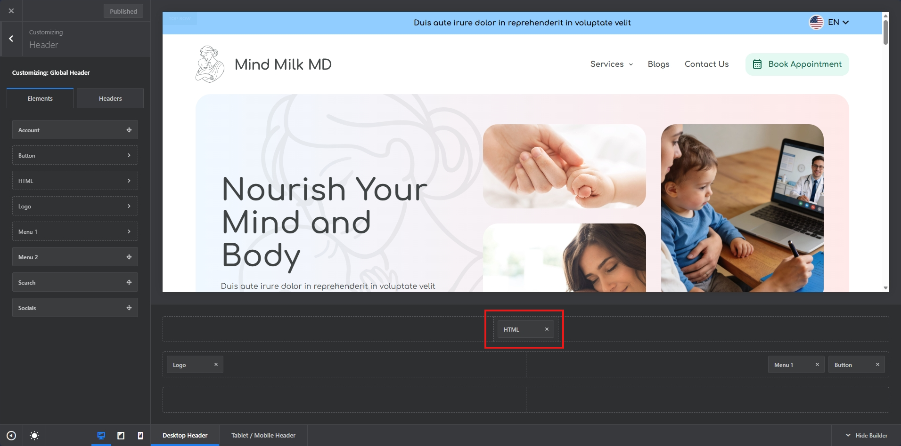
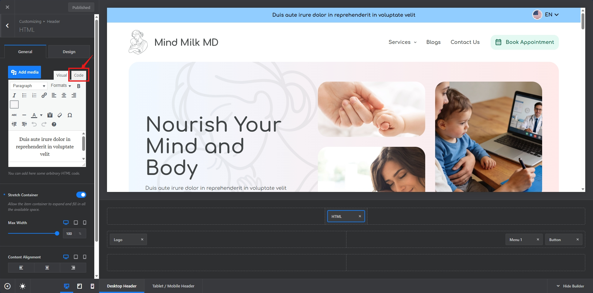
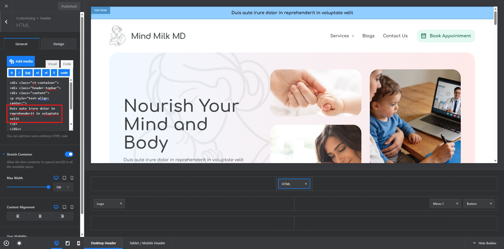

# Header

## Topbar

### Change Text

1 - Navigation to Customizer:
    

2 - Click on the HTML block:
    

3 - This gives you a view of the settings of the HTML block, click on code:
    

4 - In the code tab, you can see the text currently being used there, once you identify the text, then you can replace the text with your own, please note just replace the text part and not the code surrounding the text:
    

5 - Once Changed, then publish the changes.

### Change Background

1 - Navigation to Customizer:
    

2 - Click on the Design Tab by following the instructions shared in the image:
    

3 - Edit the color by clicking the round circle filled with existing color:
    

4 - Change the color as you like.

5 - Once Changed, then publish the changes.

## Main Navigation

1 - Navigation to Customizer:
    

2- We can take same steps performed above for updating Logo, Menu, and Book Appointment Button:

### Logo

### Menu

<strong>Note:</strong> Please refer following doc for quick guide on how to add/edit and manage menu items:

[Wordpress Menu User Guide](https://codex.wordpress.org/WordPress_Menu_User_Guide)

### Book Appointment Button

