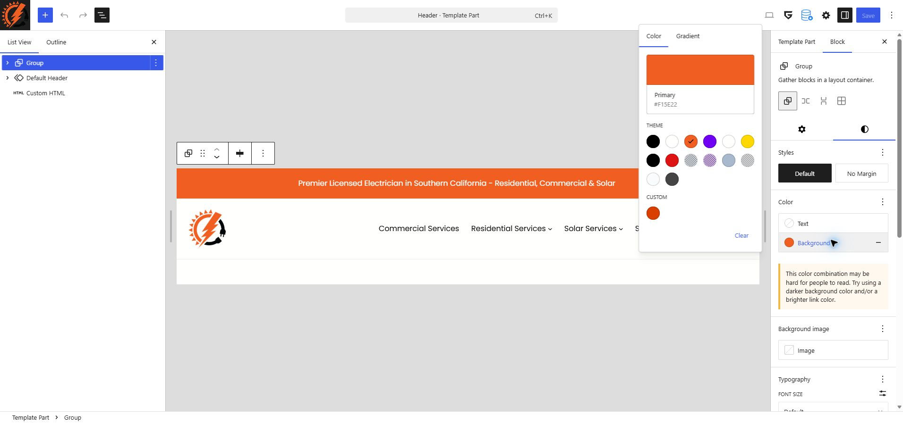
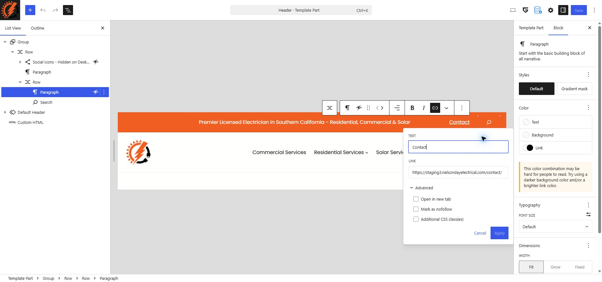
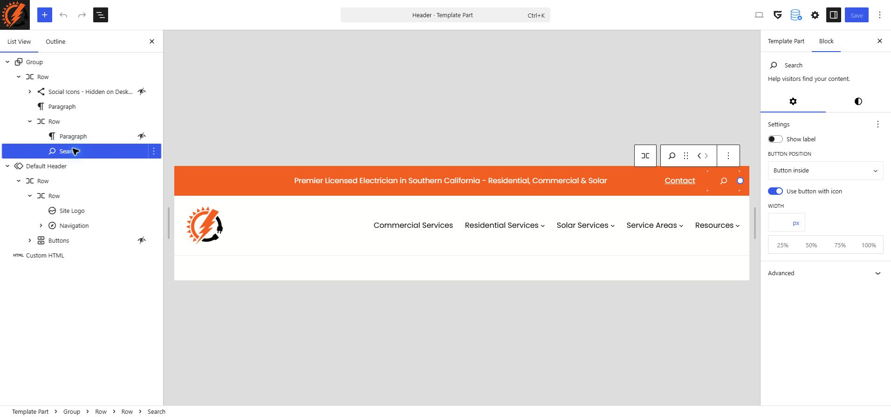
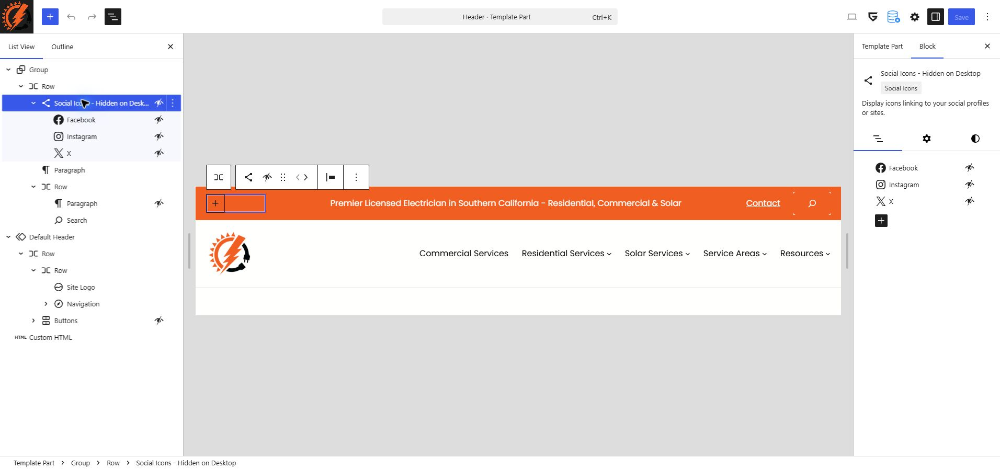
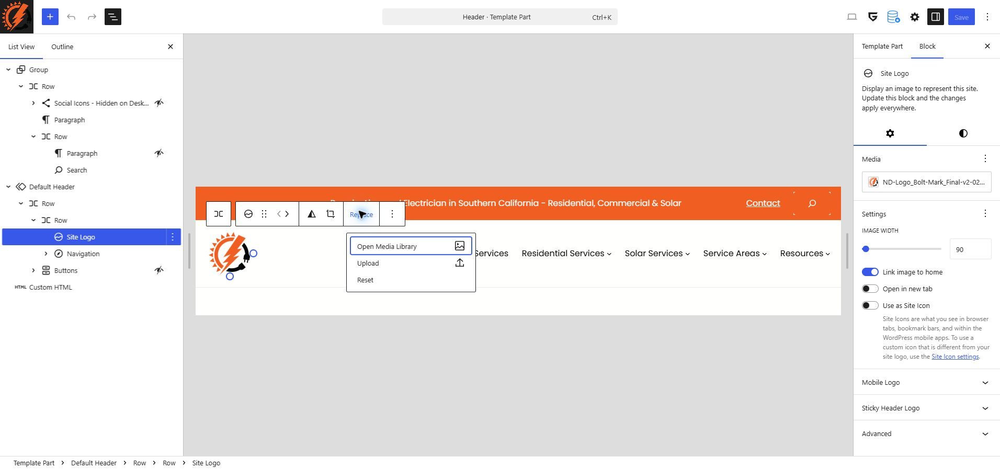
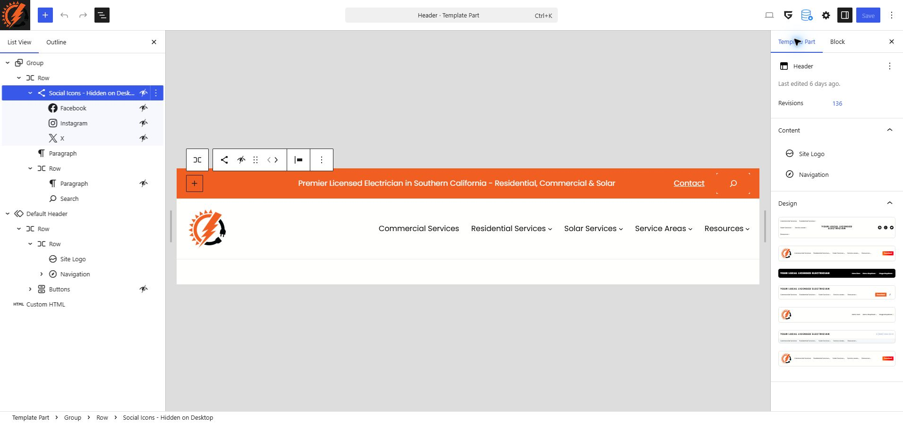

# Header

The Nelson Day Electrical header contains an orange top bar with introductory text, a Contact link, and a search icon. The main navigation below contains the company logo and links to services, service areas, and resources.

The header is a shared template part. Saving a change updates every page that uses this header, so check more than the homepage afterward.

Click any screenshot to enlarge it and read the editor controls. Screenshots show the saved project examples; the content and available controls may differ slightly in your editor.

## Open the Header Editor

1. Log in to the WordPress dashboard.
2. Go to `Appearance > Editor` to open the Site Editor.
3. Select `Patterns` from the Design menu.

4. Select `Header` under the template part categories in the left sidebar.

5. Hover over the Header preview and click its three-dot menu.
6. Select `Edit` to open the existing header.

Use the existing Header template part when updating the website. The other header designs in the pattern library are separate designs.

## Find the Element to Edit

Click the `List View` button (three horizontal lines) near the upper-left corner of the editor. Expand the arrows beside the blocks to see their contents.

The supplied editor screenshot shows these main blocks:

| Block in List View | Contents or purpose |
|---|---|
| First `Group`, then `Row` | Top bar containing social icons, the introductory paragraph, and a nested row for the right-hand controls |
| `Default Header` | Main header area containing the logo, navigation, and a `Buttons` block that is currently hidden |
| `Custom HTML` | Existing code; leave this block intact during routine content edits |

Select a block in List View to highlight it in the preview. Open the right-hand settings sidebar and choose the `Block` tab to see settings for the selected element. Available controls depend on the selected block.

## Top Bar

### Change the Introductory Text

1. In List View, expand the first `Group`, then its first `Row`.
2. Select the `Paragraph` containing the introductory text.
3. Click the text in the preview and replace it with the approved wording.
4. Keep the wording short enough to fit alongside the Contact link and search icon.

The numbered callouts identify the List View button (1), the Paragraph block (2), and the text to edit (3).

### Change the Top Bar Background

1. Select the parent `Group` that contains the top bar, rather than the Paragraph block.
2. In the right sidebar, select `Block`, then the `Styles` tab (the half-filled circle icon).
3. Under `Color`, click `Background` to open the palette. The current top bar uses the theme's `Primary` color, `#F15E22`.
4. Choose the approved brand color and check that the text, Contact link, and search icon remain readable.

Changing the Paragraph background only colors the text block. Use the container's background setting to change the entire strip, and keep the existing spacing and alignment.

### Update the Contact Link

1. Select `Contact` in the preview, or expand the nested row beneath the introductory Paragraph in List View to find it.
2. Click directly inside the linked word `Contact` to display its link preview, then click the pencil-shaped `Edit link` button.
3. Update `TEXT` for the visible label and `LINK` for the destination.
4. Click `Apply` to apply the link change, then save the header when ready.
5. Keep internal website links in the same tab and test the destination after saving.

The screenshot was captured on staging. Use the destination for the website you are editing; do not copy the staging address into the live website.

### Search Settings

The search icon sits beside Contact. Preserve its existing block and behavior when editing nearby text or links. Check that search still opens, accepts a search term, and closes normally after saving.

Select `Search` in the top bar's nested row to see `Block > Settings`. The current settings have `Show label` off, `Button position` set to `Button inside`, and `Use button with icon` on. These controls are shown below for reference; keep the existing configuration for routine content edits.

### Social Icons

Expand `Social Icons - Hidden on Desktop` in List View to find Facebook, Instagram, and X. Selecting the group also displays these items in the right sidebar's `List View` tab.

The icons are hidden in this desktop editor view, and selecting an individual icon here does not expose its destination field. Do not change visibility just to edit a link. Use a view where the icon is visible to access its link control, and preserve the existing visibility settings.

## Main Header

### Change the Logo

1. Expand `Default Header` in List View and select the logo, or click the logo directly in the preview.
2. Click `Replace` in the block toolbar, then `Open Media Library` to choose the approved asset, or `Upload` for a replacement file.
3. Preserve the image proportions and existing display size so the logo fits beside the navigation. The current `Image width` is `90`.
4. Keep `Link image to home` enabled and `Open in new tab` disabled in the right sidebar.
5. Leave `Use as Site Icon` disabled unless the browser-tab icon is also being replaced as part of the approved change.
6. Confirm that clicking the logo opens the homepage after saving.

If the selected element does not show image controls, expand its parent in List View and select the image or logo block inside it.

### Update the Menu

Use the [Menu Navigation guide](menu.md) for instructions on changing labels and destinations, adding links, managing dropdowns, reordering items, and checking the mobile menu.

The documented desktop header includes Commercial Services, Residential Services, Solar Services, Service Areas, and Resources. Preserve the existing menu block when changing the surrounding header so its dropdowns and mobile controls remain connected.

To open the separate menu editor, go to `Appearance > Editor > Navigation`, open the three-dot `Actions` menu (1), and select `Edit` (2).

Select a menu item to edit its visible text and destination. The callouts below identify the `Block` tab (1), `Content` tab (2), `Text` field (3), and `Link to` setting (4).

## Save and Check the Header

1. Click `Save` in the upper-right corner of the editor.
2. If WordPress displays a confirmation panel, review the listed changes and confirm the save.
3. Open the website in a new tab and refresh it.

Check the homepage and an inner page on desktop, tablet, and a phone or narrow browser window:

* The top bar text is readable and does not overlap other controls.
* The Contact link opens the intended page.
* The logo is clear, keeps its proportions, and links to the homepage.
* Main navigation links and dropdowns work.
* The mobile menu opens and closes, and its links are reachable.
* Search opens and closes correctly, and a search returns a results page.
* Social icons, where visible, open the intended profiles.
* The header fits the screen without horizontal scrolling.

The screenshot below shows the mobile menu with Residential Services expanded. Check that the submenu links are visible and that the close button at the top dismisses the menu.

If the public page looks unchanged, confirm the save completed and that you are viewing the same website you edited. Refresh the page; if needed, use the site's existing cache-clearing process and check again.

## Correct an Accidental Change

Before saving, use the editor's `Undo` button to reverse the unwanted edit. If an incorrect change has already been saved, choose the `Template Part` tab in the right sidebar and click the number beside `Revisions` to review an earlier version.

The `Actions` menu currently contains `Reset`; it does not contain the revision history. Do not use `Reset` for a routine correction because it can replace the customized header with its theme-provided version. Restoring a revision can replace other header changes made since that revision, so review it carefully and repeat the checks above afterward.

