# Header

## Topbar

### Change Text

1 - Navigation to Side Editor and select patterns:
    
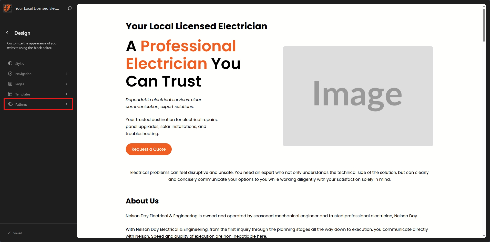

2 - Click on the Header from sidebar:
    
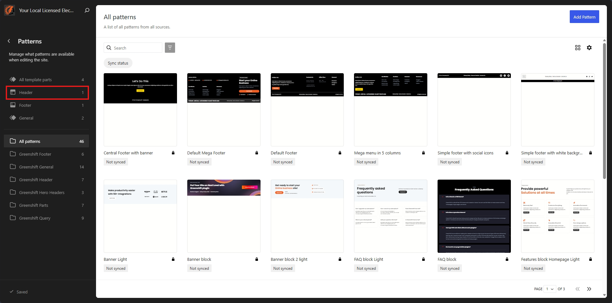

3 - Hover over the Header pattern and click the three dots to open the menu and select edit:
    
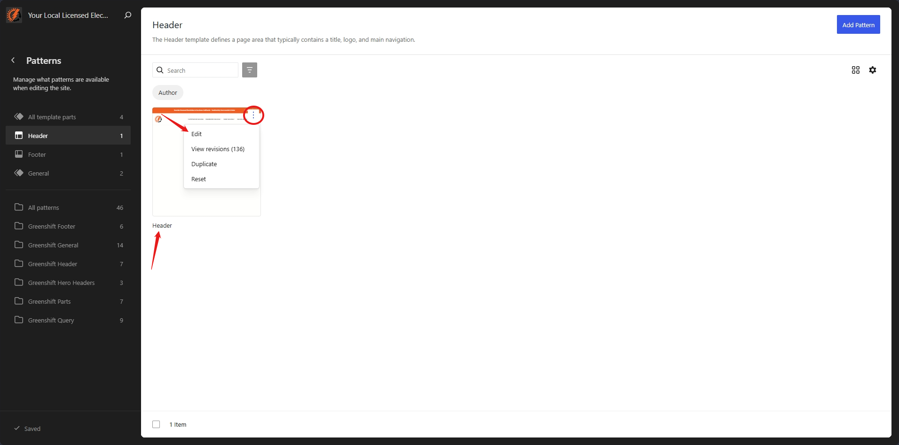

4 - Click on the 3 line bar to open the List view, and then expand the first group and row, then click the paragraph:

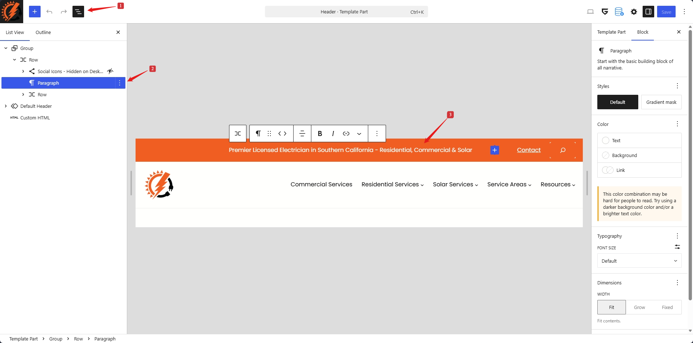

5 - Change the text and click the save button.

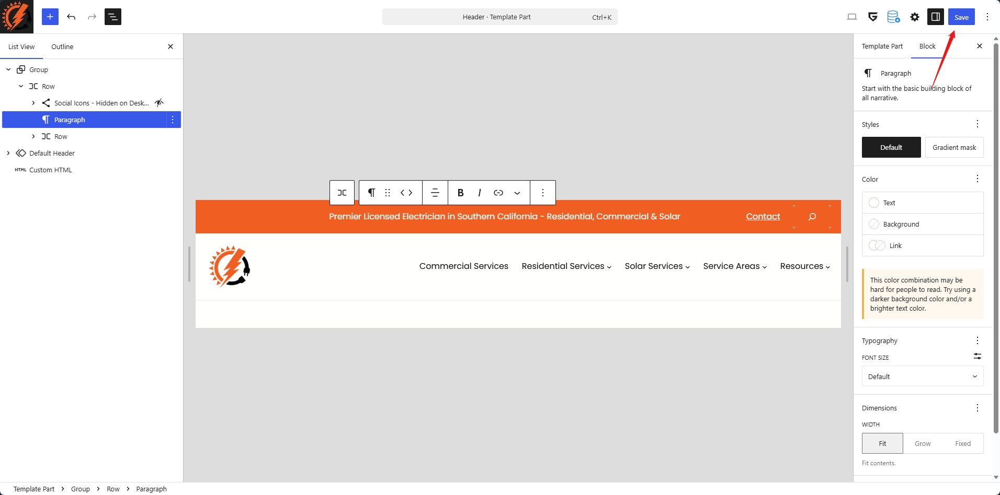

### Change Background

1 - Navigation to Side Editor:
    
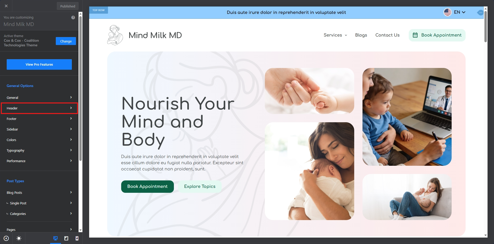

2 - Click on the Design Tab by following the instructions shared in the image:
    
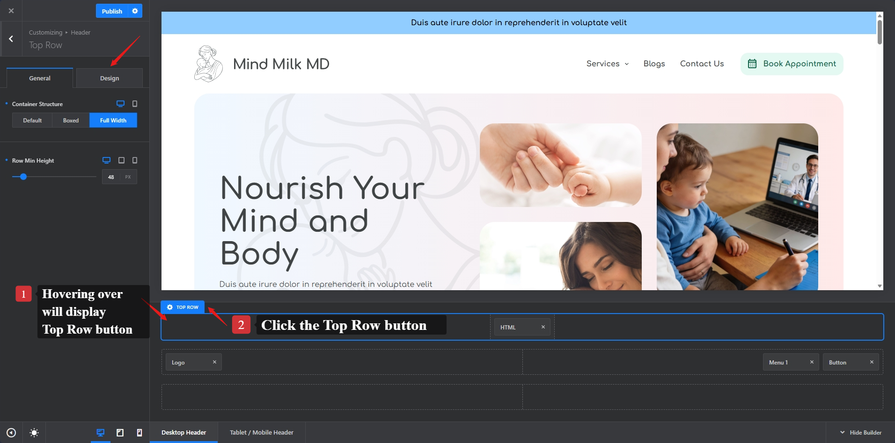

3 - Edit the color by clicking the round circle filled with existing color:
    
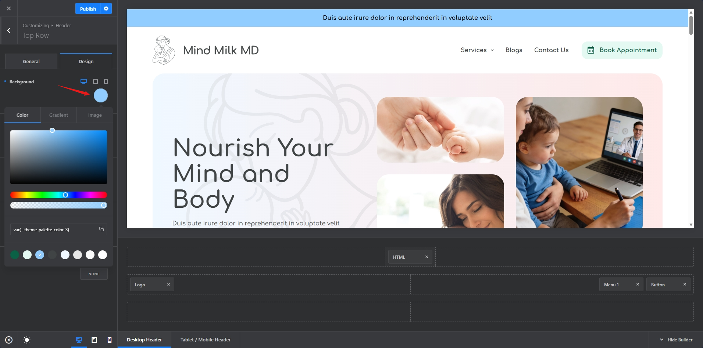

4 - Change the color as you like.

5 - Once Changed, then publish the changes.

## Main Navigation

1 - Navigation to Side Editor:
    

2- We can take same steps performed above for updating Logo, Menu, and Book Appointment Button:

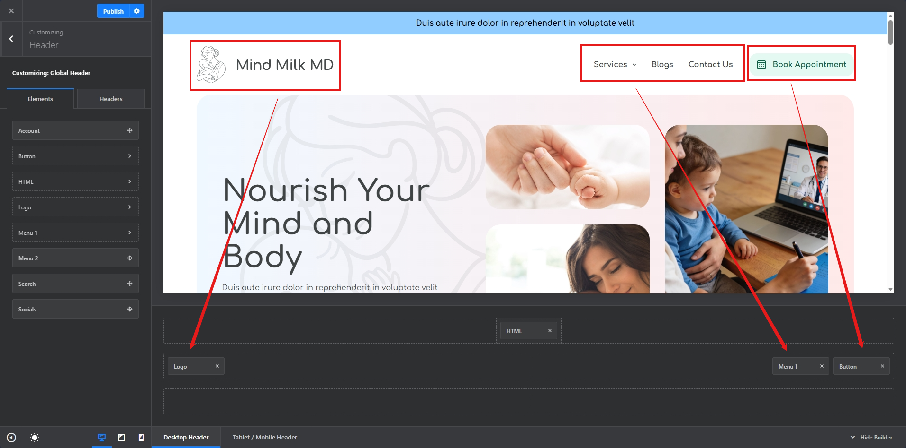

### Logo

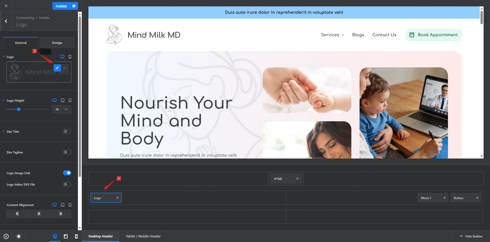

### Menu

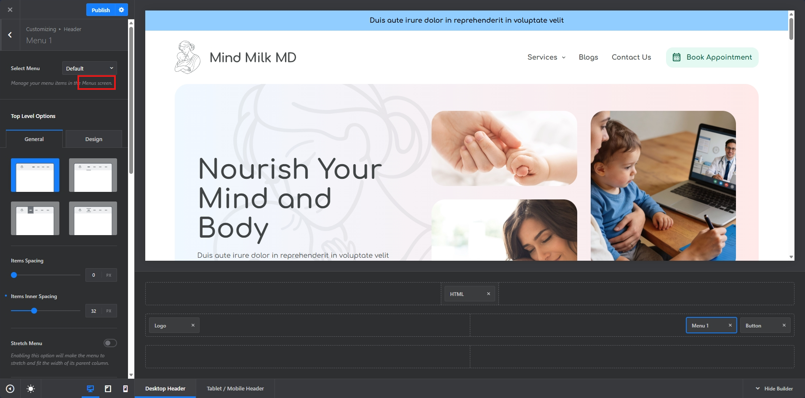

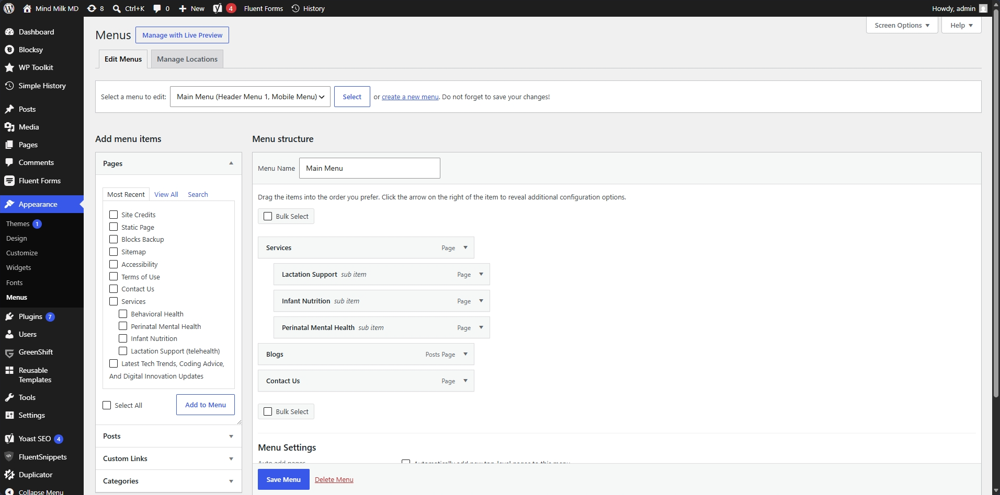

<strong>Note:</strong> Please refer following doc for quick guide on how to add/edit and manage menu items:

[Wordpress Menu User Guide](https://codex.wordpress.org/WordPress_Menu_User_Guide)

### Book Appointment Button

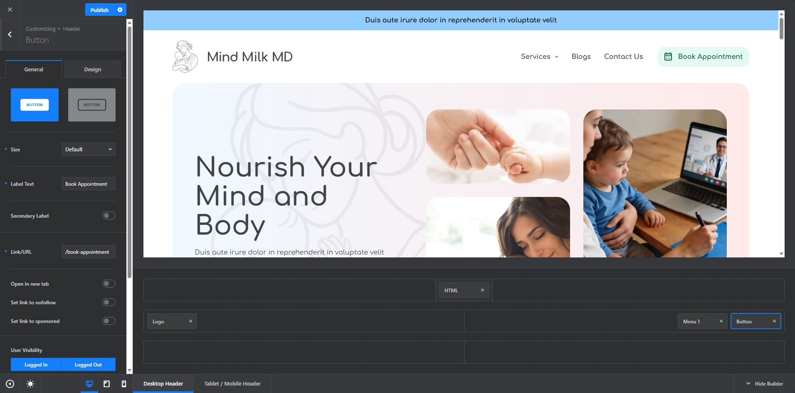