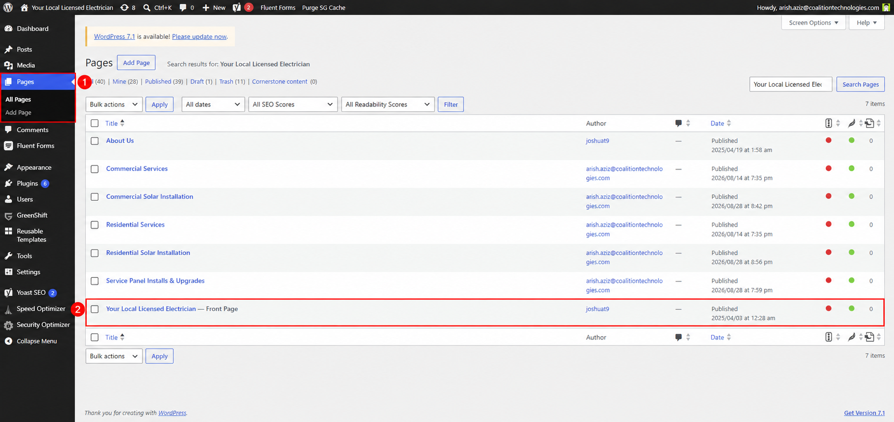
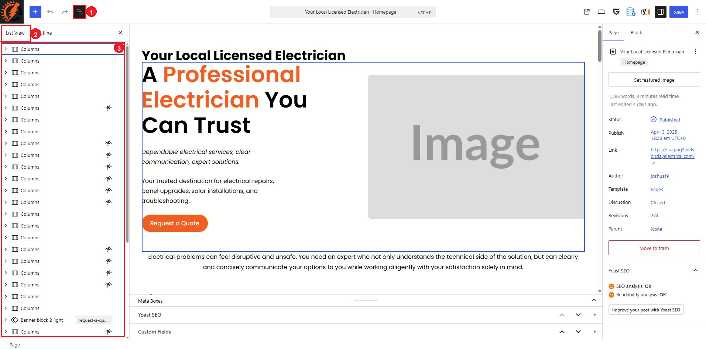

# Homepage

The homepage is the main page visitors see when they open the Nelson Day Electrical website. Its text, images, buttons, and links are edited with the WordPress block editor.

The page is named `Your Local Licensed Electrician` and is marked `Front Page` in WordPress. It uses the `Homepage` template, but routine content updates should be made on the page itself. Do not edit the `Homepage` template when you only need to change homepage content.

## Open the Homepage

1. Log in to the WordPress dashboard.
2. Go to `Pages > All Pages`.
3. Find `Your Local Licensed Electrician — Front Page`.
4. Select the page title, or hover over the row and select `Edit`.

The numbered callouts identify:

1. `Pages > All Pages` in the dashboard menu.
2. The `Your Local Licensed Electrician — Front Page` row.

## Find the Content to Edit

The homepage is made from blocks. Each block controls a particular piece of content or part of the layout.

1. Click `Document Overview` (the three-horizontal-lines button) near the upper-left corner.
2. Stay on the `List View` tab.
3. Use the arrows beside the blocks to expand their contents.
4. Select a block in List View to open that block's options in the `Block` tab on the right.

The numbered callouts identify:

1. The `Document Overview` button.
2. The `List View` tab.
3. The homepage block list.

The page includes standard WordPress blocks and GreenShift blocks. Common names you may see include:

| Block | What it usually controls |
|---|---|
| `Heading` or `Paragraph` | Visible text |
| `Image` or `Image Advanced` | A photograph, illustration, or icon |
| `Button Advanced` | Button wording and destination |
| `Columns`, `Column`, or `Stack` | The arrangement of content |
| `Row/Columns Advanced` or `Box Container` | GreenShift layout containers |
| `Text Advanced` | Text with GreenShift design options |

You do not need to learn every option before making a routine content update. Select the existing block that contains the item you need to change and leave the surrounding structure in place.

## Routine Content Changes

The following updates can usually be made directly in the existing block:

* Replace approved heading or paragraph text.
* Replace an existing image through its `Replace` control.
* Update existing button wording.
* Update an existing button or text-link destination through its `Link` control.

Keep the current blocks and layout in place. After changing linked words or button text, confirm that the destination is still correct.

## Changes That Need Extra Care

Ask the website administrator or an experienced editor for assistance before:

* Deleting, moving, or duplicating a section.
* Adding a new section or changing the number of columns.
* Changing spacing, responsive settings, animations, or advanced GreenShift options.
* Changing global colors, fonts, or reusable styles.
* Editing the `Homepage` template instead of the page.

These changes can affect the page layout on desktop, tablet, or mobile devices.

## Preview, Save, and Check the Homepage

1. Use `View` in the upper-right toolbar to preview the page.
2. Check the updated section on desktop, tablet, and a phone or narrow browser window.
3. Confirm that text is readable, images are clear, and every edited button or link opens the intended destination.
4. Click `Save` only after the preview is correct.
5. Open the public homepage in a new tab and refresh it to confirm the saved result.

If the public page appears unchanged, confirm that the save completed and that you are viewing the same website you edited. Refresh the page and use the website's existing cache-clearing process if needed.

## Correct an Accidental Change

Before saving, use `Undo` in the upper-left toolbar. If an incorrect change has already been saved, open the `Page` tab in the right sidebar and select the number beside `Revisions`.

Restoring a revision can also replace other homepage changes made since that revision. Review the selected revision carefully and repeat the homepage checks afterward.

## Block Editor Tutorials

These resources explain the editor controls in more detail:

* [Using the Block Editor — Learn WordPress](https://learn.wordpress.org/tutorials/using-the-block-editor/)
* [WordPress Block Editor documentation](https://wordpress.org/documentation/article/wordpress-block-editor/)
* [GreenShift video tutorial playlist on YouTube](https://www.youtube.com/playlist?list=PLIEKo1RENmYxv7s01erTf4Y6JbClr5AEk)
* [GreenShift block documentation](https://greenshiftwp.com/documentation/blocks/)

The WordPress resources cover the general editor. The GreenShift resources explain the additional blocks and design options used on this homepage.
