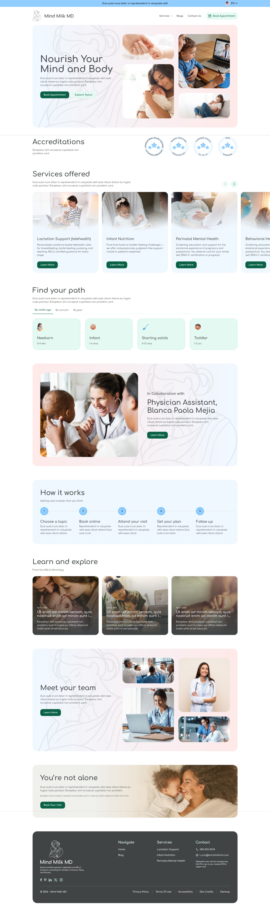
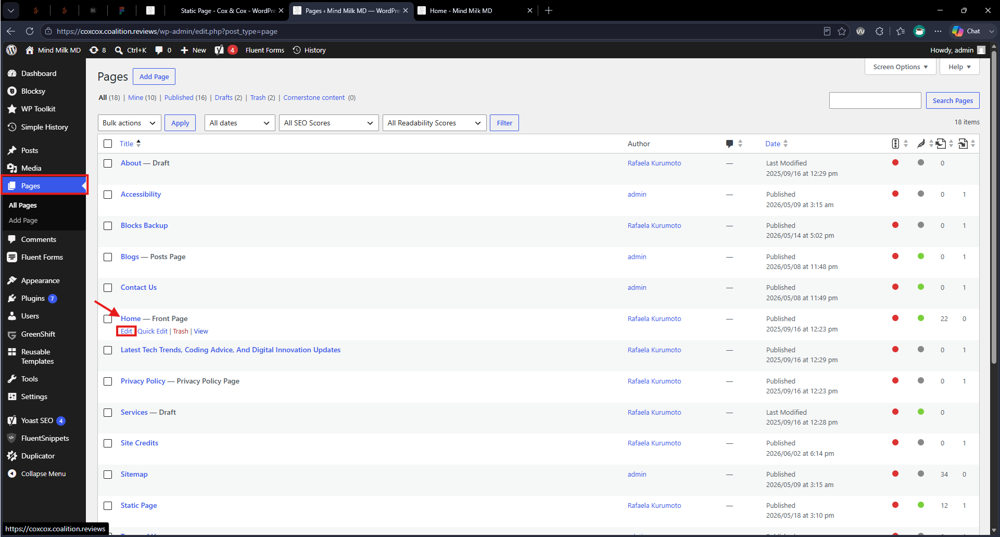
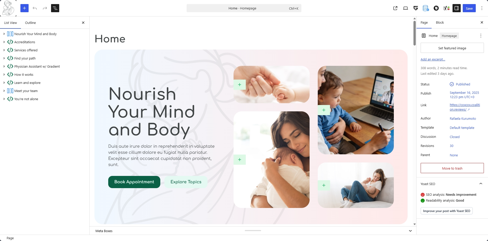

# Homepage

This page documents the custom homepage build delivered in WordPress using Blocksy + Greenshift.

## Implementation Notes

* Built with Gutenberg/Greenshift blocks.
* Desktop mockup is the visual source of truth.
* Mobile and tablet behavior were implemented responsively without dedicated mockups.

## Custom Build Notes (Confirmed in Theme Code)

Homepage-related custom classes and behavior exist in child theme CSS/JS:

* `ct-services-offered` section styling and responsive card behavior
* `ct-milk-mind-blogs` section styling and card overlays
* `ct-youre-not-alone` visual overlay treatment
* Embla slider behavior via `js/script.js` and CDN enqueue in `functions.php`

## Typical Homepage Sections

The homepage was built with reusable block sections. Exact section naming in admin may vary, but generally includes:

* Nourish Your  Mind and Body (headline, supporting copy, call-to-action, image/background)
* Accreditations
* Find your path
* Physician Assistant w/ Gradient
* How it works
* Learn and explore
* Meet your team
* You're not alone

## Editing the Homepage

1. Go to `Pages > Home` (or the page assigned as Front Page in Settings).
2. Open with block editor.
3. Update text, links, and media directly in each section block.
4. For layout adjustments, use the block sidebar settings (spacing, alignment, columns, stacking).
5. Preview desktop/tablet/mobile before publishing.

[Quick Tutorial on Gutenberg WordPress](https://youtu.be/te7aHH7trts?t=21&si=HtpeaElcMJfPp5v9)

## Greenshift Block Guidance

* Reuse existing blocks/patterns before creating new styles.
* Prefer duplicating existing sections and editing content to keep style consistency.
* Keep typography, spacing, and button styles aligned with existing homepage blocks.
* Avoid adding extra plugins for layout if the same result can be achieved with current Greenshift + core blocks.

## Responsive Behavior Guidelines

Since there were no mobile-specific mockups, use these rules:

* Maintain content hierarchy from desktop.
* Stack multi-column sections on smaller screens.
* Keep CTA buttons easy to tap and fully visible.
* Avoid text overlays that become unreadable on mobile.
* Adjust spacing/padding to prevent cramped sections.

## Caution

* Global styles may affect multiple sections/pages. Validate after major style changes.
* If a section appears visually broken, check responsive controls and inherited block styles first.
