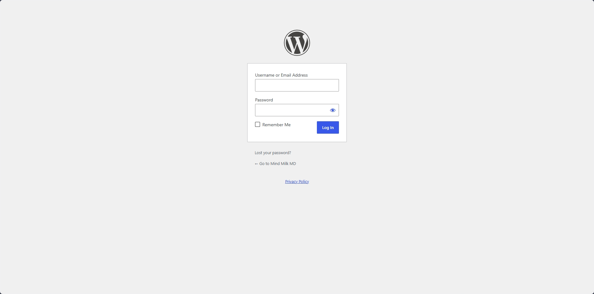
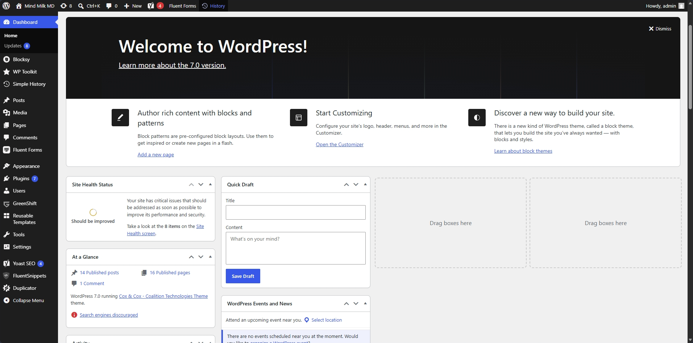
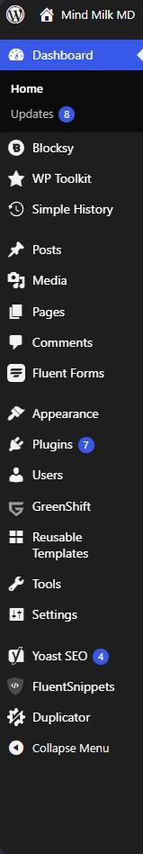
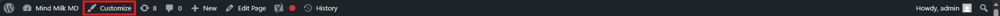
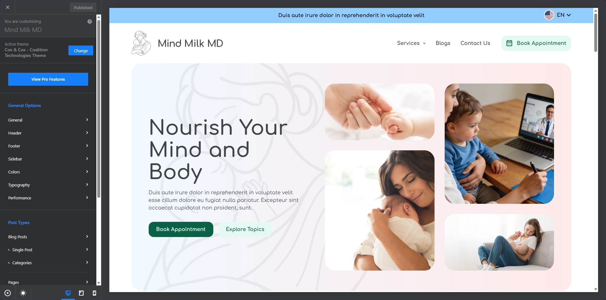
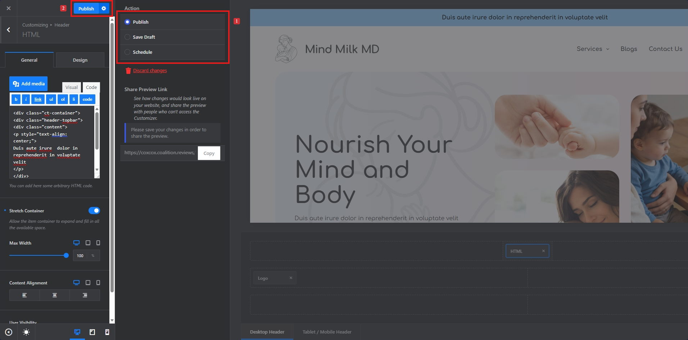

# Welcome to Nelson Day Electrical WordPress Documentation by Coalition Technologies

## What is WordPress?

WordPress is a **Content Management System (CMS)** - a tool that lets you build and manage a website without needing to write code. You create and edit content through a visual admin panel, and WordPress handles displaying it to your visitors.

## How WordPress Works

WordPress has two sides you need to know:

- **Backend** (the Dashboard) - where you log in to manage content, change settings, and control how the site works. Only you and your team can see this.
- **Frontend** (the public website) - what your visitors see when they browse your site at its URL.

> **Think of it like a restaurant:** The backend is the kitchen where everything is prepared. The frontend is the dining area where customers see and enjoy the final result.

### Posts vs Pages

New WordPress users often wonder when to use a Post vs a Page. Here's the difference:

| | Posts | Pages |
|---|---|---|
| **Used for** | Blog articles, news, updates | Static content like "About Us", "Contact" |
| **Organized by** | Categories & tags | Hierarchical (parent/child) |
| **Shown on** | Blog listing page | Individual URLs |
| **Timely?** | Yes - dated, reverse order | No - timeless content |

## Tech Stack

* WordPress (CMS)
* Greenshift (free theme)
* Greenshift (free plugin)

## Designed Pages

* [Header](header.md)
* [Footer](footer.md)
* [Homepage](home.md)
* [Static Page](static.md)
* [Blog List](blog-list.md)
* [Blog Post](blog-post.md)
* [Menu](menu.md)

## WordPress Login

Before proceeding, make sure you are logged into the WordPress backend. Use the following URL to log in:

Login Path: site.com/wp-login.php

## WordPress Dashboard

Once logged in, you will see the following screen:

The dashboard is the WordPress backend where all site settings - both appearance and functionality - are managed.

Note: Some menu items may be hidden based on your user role. Only Administrators see all options.

### Dashboard Sidebar Menu:

Here's a quick description of the menu items available in the left sidebar, these menu items will be used to navigate between site options:

<ul>
    <li><strong>Dashboard</strong>: Shows your at-a-glance admin home screen and core update alerts.</li>
    <li><strong>Posts</strong>: Where you create, edit, and organize blog posts using categories and tags.</li>
    <li><strong>Media</strong>: Your library for uploading, storing, and managing images, videos, and documents.</li>
    <li><strong>Pages</strong>: Where you create and manage static pages like "About Us," "Contact," or your Homepage.</li>
    <li><strong>Comments</strong>: Where you moderate, reply to, or delete visitor comments on your posts.</li>
    <li><strong>Appearance</strong>: Where you change your website's visual theme, customize layouts, and edit menus.</li>
    <li><strong>Plugins</strong>: Where you install and manage add-ons that expand your site’s functionality (e.g., SEO, e-commerce).</li>
    <li><strong>Users</strong>: Where you manage accounts, assign roles (like Editor or Administrator), and edit user profiles.</li>
    <li><strong>Tools</strong>: Includes features to import/export data, erase personal data, and manage site health.</li>
    <li><strong>Settings</strong>: Where you configure global parameters for your site, including general URL details, reading/writing preferences, and discussion rules.</li>
</ul>

## WordPress Customizer

The WordPress Customizer lets you modify site and theme settings such as colors, typography, and layout. Access it via the Customizer icon in the admin toolbar:

<strong>Note:</strong> You will need to be logged into the site for the admin toolbar to appear.

## Publish Customizer Changes

Changes you make in the Customizer are **not live** on the site until you publish them. Here's how:

<strong>Note:</strong> Any changes made in the customizer would count as a change and needs to be published to reflect on the live site.

- **Publish** — Click the **Publish** button at the top of the Customizer panel to push all your changes live immediately.
- **Save Draft** — Use the gear icon next to the Publish button to save your changes as a draft without making them public.
- **Schedule** — You can also schedule your changes to go live at a specific date and time.

> **Important:** If you navigate away without publishing, your unsaved changes will be lost.

Clicking the Gear icon next to the publish button, will open up a panel which will display all the above options. You can skip the step marked as 1 in above image, if you don't plan on drafting or sceduling the changes but to directly publish them.

## Dashboard vs Customizer

New users often confuse these two. Here's the difference:

| | Dashboard | Customizer |
|---|---|---|
| **Purpose** | Manage content & site settings | Change the visual appearance |
| **What you do** | Create posts, upload media, install plugins | Edit colors, fonts, layout, menus |
| **Live preview?** | No | Yes - see changes in real-time |
| **Access from** | site.com/wp-admin | Admin toolbar → Customize |

## Quick Reference: Common Tasks

| I want to… | Go to |
|---|---|
| Write a blog post | Dashboard → **Posts** → Add New |
| Edit a page | Dashboard → **Pages** → click the page |
| Upload an image | Dashboard → **Media** → Add New |
| Change colors or fonts | **Customizer** → Colors / Typography |
| Add a navigation menu item | **Customizer** → Menus |
| Install a new plugin | Dashboard → **Plugins** → Add New |
| Add a new user | Dashboard → **Users** → Add New |
| Change the site title | **Customizer** → Site Identity |

## Useful URLs

<ul>
    <li>Login URL: site.com/wp-login.php</li>
    <li>Customizer URL: site.com/wp-admin/customize.php</li>
</ul>

## External Documentation (Opens in New Tab)

* <a href="https://wordpress.org/documentation/" target="_blank" rel="noopener noreferrer">WordPress Documentation</a>
* <a href="https://creativethemes.com/blocksy/docs/" target="_blank" rel="noopener noreferrer">Blocksy Documentation</a>
* <a href="https://greenshiftwp.com/documentation/" target="_blank" rel="noopener noreferrer">Greenshift Documentation</a>
* <a href="https://wordpress.org/support/article/appearance-menus-screen/" target="_blank" rel="noopener noreferrer">WordPress Menus Guide</a>
* <a href="https://wordpress.org/support/article/writing-posts/" target="_blank" rel="noopener noreferrer">WordPress Posts Guide</a>
* <a href="https://embla-carousel.com/get-started/" target="_blank" rel="noopener noreferrer">Embla Carousel Documentation</a>
