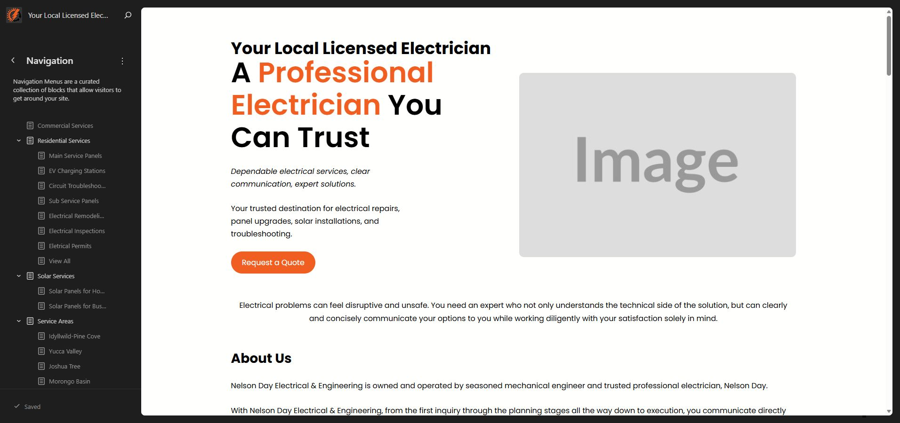
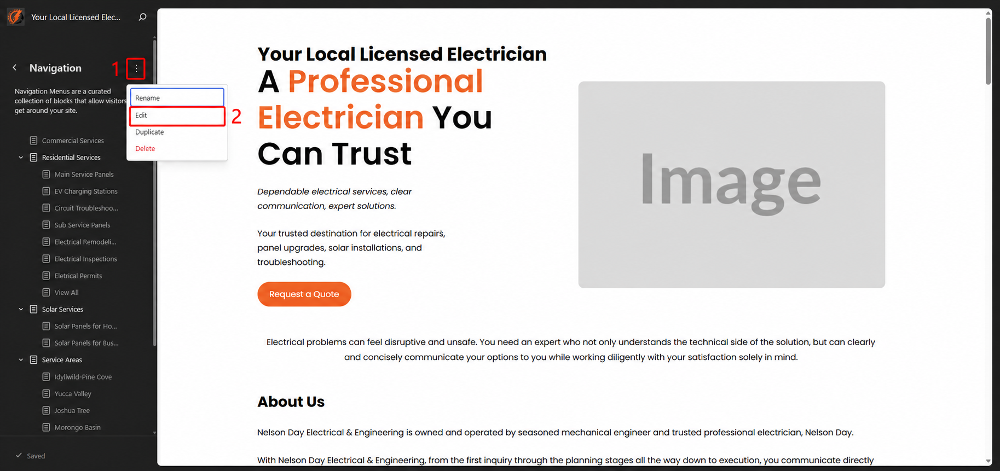
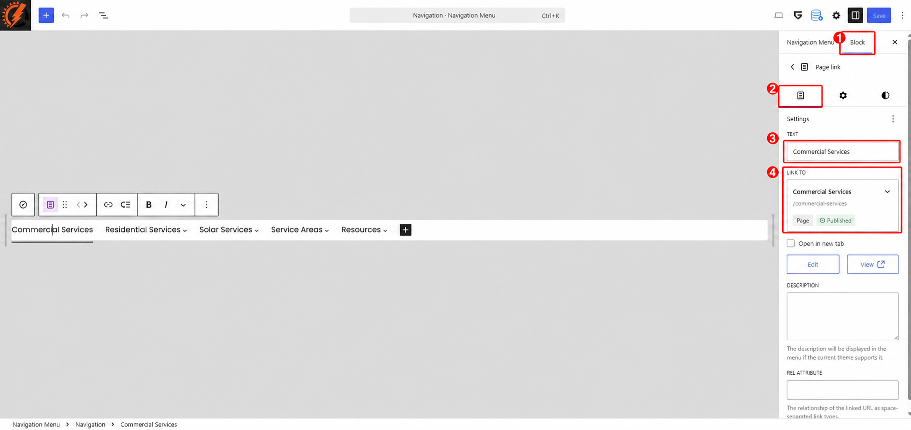
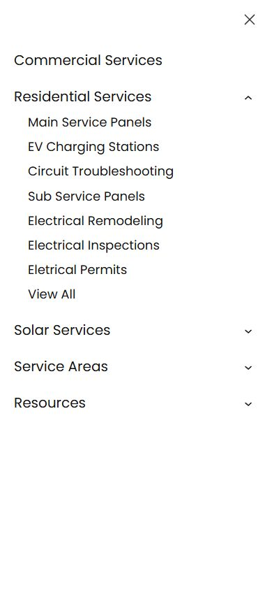

# Menu Navigation

The website menu helps visitors move between the main service, service area, and resource pages. This guide explains how to update the menu in the WordPress Site Editor without changing the rest of the header.

## Open the Navigation Screen

1. Log in to the WordPress dashboard.
2. Go to `Appearance > Editor`.
3. Select `Navigation` from the Design menu.
4. Review the menu items shown in the left panel.

The current menu contains both main menu items and dropdown items. Items aligned at the far left are main menu items. Indented items appear inside a dropdown.

## Open the Menu Editor

1. On the Navigation screen, click the three-dot `Actions` button beside the Navigation heading.
2. Select `Edit`.

The menu will open in the block editor. The main menu appears in the center of the screen, and its settings appear in the right sidebar.

## Change a Menu Item

1. Select the menu item you want to update.
2. In the right sidebar, stay on the `Block` tab and open the `Content` section.
3. Update the `Text` field to change the name visitors see.
4. Review the `Link to` field to make sure the item opens the correct page.
5. Use `Open in new tab` only when the link should open in a separate browser tab. For normal website pages, leave this option turned off.
6. Click `Save` in the upper-right corner when the changes are ready.

The numbered callouts identify the `Block` tab (1), `Content` tab (2), `Text` field (3), and `Link to` setting (4).

Changing the menu text does not change the title of the page itself. Changing the destination does not delete or edit the linked page.

## Add a Menu Item

1. Open the menu in the Navigation editor.
2. Click the `Add page` button at the end of the menu.
3. Search for an existing page and select it.
4. To link to a different website or another URL, type or paste the full URL instead.
5. Check the menu item's text and destination in the right sidebar.
6. Move the new item to the correct position before saving.

Avoid adding unpublished or unfinished pages to the public menu.

## Create or Update a Dropdown

1. Select the item that should act as the dropdown heading.
2. Click `Add submenu` in the block toolbar.
3. Search for and select the page that should appear inside the dropdown.
4. Repeat the step for any additional dropdown links.
5. Check the List View to confirm that each dropdown link is indented beneath the correct heading.

Keep dropdowns short and group related pages together. The current main navigation uses dropdowns for Residential Services, Solar Services, Service Areas, and Resources.

## Reorder Menu Items

1. Select the menu item in the editor or List View.
2. Use the move controls in the block toolbar, or drag the item in List View.
3. Move an item left to place it earlier in the main menu.
4. Move an item right to place it later in the main menu.
5. Confirm that dropdown items remain beneath the correct parent item.

After reordering, review the complete menu before saving. Moving a parent item also moves its dropdown items.

## Remove a Menu Item

1. Select the menu item you want to remove.
2. Open its three-dot `Options` menu.
3. Select `Remove`.
4. Review the rest of the menu, then click `Save`.

Removing an item from the menu does not delete the page. It only removes the link from this navigation menu.

## Save and Check the Menu

1. Click `Save` in the upper-right corner.
2. Review the changes listed in the save panel.
3. Confirm the save.
4. Open the front end of the website in a new tab.
5. Check the menu on desktop and on a phone or narrow browser window.

Confirm that:

* Every link opens the intended page.
* Dropdowns open and close correctly.
* Main menu items appear in the intended order.
* Dropdown items appear beneath the correct heading.
* The mobile menu opens, scrolls, and closes normally.
* No text is clipped or overlapping.

The following image shows the mobile menu with the Residential Services dropdown expanded:

If the menu looks unchanged after saving, refresh the page and clear the website cache before checking again.
