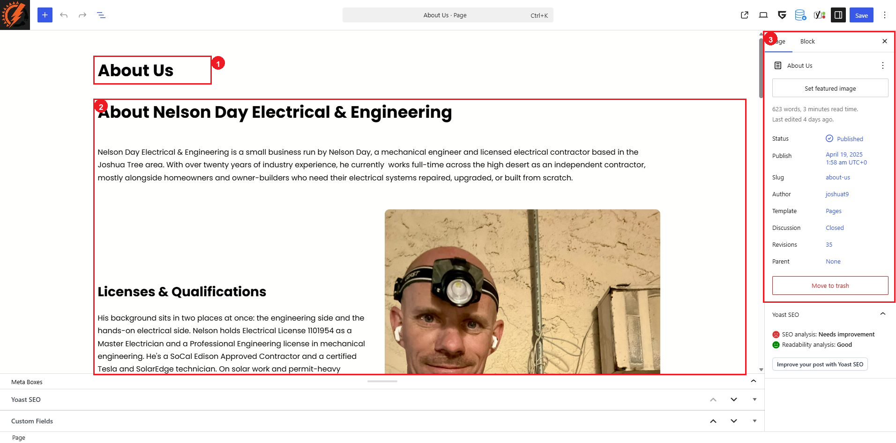

# Static Pages

Static pages contain information that does not belong to the blog. Examples include `About Us`, service pages, service-area pages, and `Contact`.

Most routine updates are made on the individual page. The current static pages use the `Pages` template, which supplies the shared page layout around their content.

## Open a Static Page

1. Log in to the WordPress dashboard.
2. Go to `Pages > All Pages`.
3. Find the page you need. Use `Search Pages` if the list is long.
4. Select the page title, or hover over its row and select `Edit`.

Do not select `Quick Edit` when you need to change the visible page content. `Quick Edit` is for administrative details rather than the blocks displayed on the page.

## Understand the Page Editor

The numbered callouts identify:

1. The page title.
2. The page's existing content blocks.
3. The `Page` settings panel.

Click visible text or an image in the main editing area to select its block. For a longer page, click `Document Overview` in the upper-left toolbar and stay on the `List View` tab. Selecting a block in List View also selects it on the page.

The current pages contain standard WordPress blocks and GreenShift blocks. Names you may see include `Paragraph`, `Image`, `Columns`, `Stack`, `Heading Advanced`, `Row/Columns Advanced`, `Box Container`, and `Text Advanced`.

## Make a Routine Content Change

### Change Text

1. Select the existing heading or paragraph.
2. Edit the words directly in the page.
3. Keep the existing block and its formatting in place.

### Replace an Image

1. Select the existing image.
2. Use the block toolbar's `Replace` control.
3. Choose an approved image from the Media Library or upload an optimized image.
4. Add appropriate alternative text when the image communicates useful information.

### Change a Link

1. Select the linked text, button, or block.
2. Open its `Link` control.
3. Replace the destination and apply the change.
4. Use `View` to test the link before saving.

Changing a linked block can be less obvious than changing text. If the link control is not visible, select the item in `List View` and check the `Block` tab in the right sidebar.

## Use the Page Settings Carefully

The `Page` tab currently includes settings such as `Status`, `Publish`, `Slug`, `Author`, `Template`, `Discussion`, `Revisions`, and `Parent`.

For a normal content update:

* Leave `Template` set to `Pages`.
* Do not change `Slug` unless the website administrator has approved a URL change.
* Do not change `Parent` unless the page hierarchy is intentionally being reorganized.
* Use `Revisions` if a previously saved version needs to be reviewed.

Changing a slug can break bookmarks, menu links, and search-engine results. Changing the template can alter the entire page layout.

## Preview, Save, and Check the Page

1. Open `View` in the upper-right toolbar and preview the page.
2. Check the edited section at desktop width and in a narrow mobile-sized window.
3. Confirm that text is readable, images display correctly, and edited links open the intended destination.
4. Select `Save` only after the preview is correct.
5. Open `View Page`, refresh it, and confirm the saved result.

Before saving, use `Undo` in the upper-left toolbar to reverse an accidental change. If the change was already saved, use `Revisions` in the `Page` tab and review the revision carefully before restoring it.

## Changes That Need Extra Care

Ask the website administrator or an experienced editor before:

* Deleting, moving, or duplicating a section.
* Adding a new section or changing the number of columns.
* Changing the `Pages` template.
* Changing responsive settings, spacing, animation, or advanced GreenShift options.
* Editing a form or shared design element.

These changes can affect the page layout on multiple screen sizes or change other pages that share the same design.

## Block Editor Tutorials

* [Using the Block Editor — Learn WordPress](https://learn.wordpress.org/tutorials/using-the-block-editor/)
* [WordPress Block Editor documentation](https://wordpress.org/documentation/article/wordpress-block-editor/)
* [GreenShift video tutorial playlist on YouTube](https://www.youtube.com/playlist?list=PLIEKo1RENmYxv7s01erTf4Y6JbClr5AEk)
